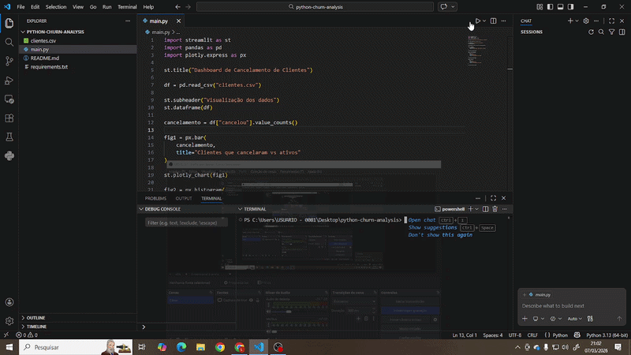

# python-churn-analysis
##  Demonstração

## Objetivo do Projeto
Muitas empresas enfrentam problemas com cancelamento de clientes (churn).  
A análise desses dados permite identificar padrões e apoiar decisões estratégicas para retenção de clientes.

Este projeto busca:
- analisar dados de clientes
- identificar padrões de cancelamento
- visualizar os dados por meio de gráficos interativos
- construir um dashboard simples para exploração dos dados

## Tecnologias Utilizadas
- Python
- Pandas
- Plotly
- Streamlit

## Bibliotecas utilizadas:
- **Pandas** → manipulação e análise de dados
- **Plotly** → criação de gráficos interativos
- **Streamlit** → criação do dashboard web

## Análises Realizadas
O dashboard permite visualizar:

### Distribuição de cancelamentos
Mostra quantos clientes cancelaram e quantos permanecem ativos.

### Cancelamento por idade
Permite analisar se determinadas faixas etárias apresentam maior taxa de cancelamento.

### Cancelamento por plano
Mostra quais planos apresentam maior índice de cancelamento.

---
OBS: 
0 = cliente ativo
1 = cancelou
